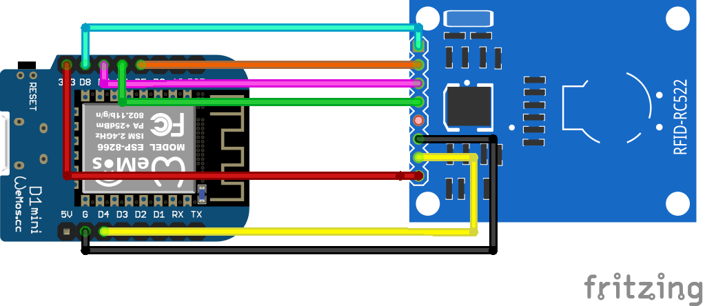

# mfrc522cli
A generic serial cli interface for writing mifare classic cards using an ESP8266 and a mfrc522 module

## This is a cli serial interface for mfrc522
  It allows to copy, modify or clone cards using a serial interface commands.
  It also allows to write block zero or fix a magic card
   
Commands: read, write, lka, show, lb, clean, fix, set
  
  ### command: lka (sector) (key)
description: load key A for a sector. This key will be used in read or write card commands.
parameter: sector number
parameter: key
example:
```
    lka 3 a0a1a2a3a4a5 
```
load key a0a1a2a3a4a5 into internal buffer for sector 3

### command: lb (block number) (data)
description: loads to internal buffer the data for a specified block number 
parameter: block number
parameter: 16 bytes hex data in ascci mode 
example: 
```
    lb 4 fffebbccaabbcc112233445566aa1122
```

  ### command: read (card/uid)
description: read to the buffer a mifare classic card using keys. default FFFFFFFFFFF
params: card / uid
example:
```
  read card 
```
  reads a entire card and store data to write buffer except trailer sectors blocks

 ### command: write (zero) (trailer) (card) (clone)
writes data buffer to the card. To see what data is going to be written "show write"

write card: write data from internal buffer to card. By default this doesn't copy trailer blocks or block zero to destination card.

write zero: enables writing the zero block in magic cards.

write trailer: Enable writing trailer blocks.

write clone: is the same than zero + trailer + card

DANGEROUS: When you write a trailer block you are writing a new Key A and Key B and permissions

### command: show [data] [keys] [uid]
description: show 

parameter: data - show blocks to write (all blocks if 
read command or several if lb command)

parameter: keys  - show loaded keys for read or write commands

parameter: uid   - show uid card (needed to aproach it to the reader)
example:
```
    show data
    show uid
    show keys
```
### command: clear (data) (keys) [all]
description: clear stored buffer data 
example:
```
    clear data  -  clear readed or loaded data stored in buffer
    clear keys  -  clear all loaded keys to FFFFFFFFFFFF
```

### Command: set echo off / on (default on)
description set global variables

```
set echo off
```
disables serial command echo. This allows to read values faster and without serial buffer errors.

### Command: fix (start) (card)  (stop)

description: This command allows to fix a unresponsive magic card.

Also can overwrite a trailer block of each sector in magic cards and recover them with key A and key B set to FFFFFFFFFFF

This not work with common cards only with magic cards.
Usage:
```
  fix start
```

(optional) to overwrite trailer sectors to default:
```
fix trailer
```

then approach the card to reader
```
  fix stop
```
if fix doesn't work,this stops trying to fix a card.

fix card == fix zero + fix trailer

## Examples:

### Write block 4 of a card:
```
clear // clear data en keys buffer
lb 4 fffebbccaabbcc112233445566aa1124
lka 1 7d8037235cff // block 4 belongs to sector 1
```
```
# show keys
> show
FFFFFFFFFFFF
7D8037235CFF
FFFFFFFFFFFF
[...]
# show data
> show
4 FFFEBBCCAABBCC112233445566AA1124
```

```
write card
```

### clone a card.

WARNING: Clonning a card is dangerous, you'll  overwrite trailer blocks and depending of the access bits you can brick the card or block acces to a sector.

If you card is a magic card probably you will be able to fix it with <fix trailer> command.

Steps:
load keys to read origin card (default keys are ffffffffffff) and read card to internal buffer.
This reads the entire card except trailer blocks.
```
lka 0 ffffffffffff
lka 1 ffffffffffff
[...]
read card
```
Now your card data is in internal buffer, you can see it with:
```
show data
```

Then load to internal buffer destination card keys A
```
lka 0 ffffffffffff
lka 1 ffffffffffff
[...]

```
or 
```
clear keys 
```
if all your destination keys are FFFFFFFFFFFF

And write block zero + trailer + data = clone
```
write clone
```

